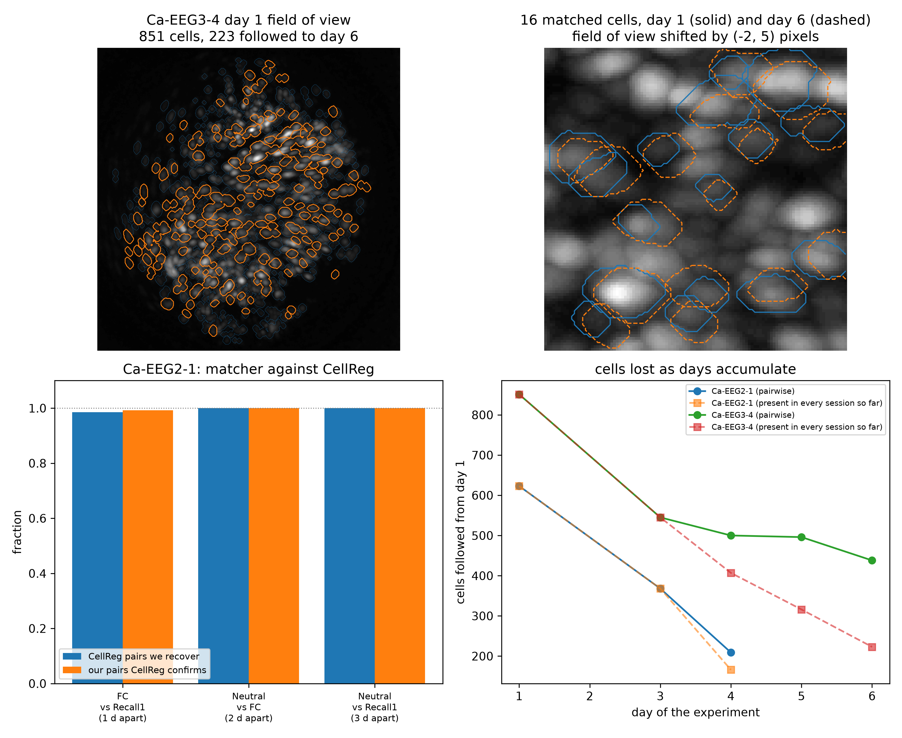

# Drift of CA1 context codes across days

Does a place stay recognisable in hippocampal activity days after you last saw it? This is a
short exploratory study of public chronic calcium imaging from mouse CA1
([DANDI:000718](https://dandiarchive.org/dandiset/000718), Zaki et al., Nature 2025), in which
mice visit a neutral room, are fear conditioned in a second room two days later, and are then
returned on three consecutive days to the shock room, a novel room and the neutral room. I
follow the same cells across all six days and ask whether the population code identifies the
room. It does not. Ensemble overlap and population similarity sit above chance for every pair of
sessions while failing to distinguish same-context pairs from different-context pairs,
similarity falls steadily as the gap between two sessions grows (Spearman -0.82, p = 0.006 by
shuffling, 10 pairs), and a decoder trained on day 1 against day 3 scores 0.497 on held-out
days, at chance. Distance in the code tracks elapsed time.

**[Read the report (PDF)](report/report.pdf)**



*Cells followed across six days, and the matcher checked against the CellReg tables that ship
with one of the two mice: it recovers 98.5 to 100 percent of their pairs.*

## What is here

| Path | Contents |
|---|---|
| `src/` | loading and streaming, cell matching, ensembles, population similarity, decoding, behaviour |
| `scripts/` | one script per phase, each writing its own figures and results |
| `results/` | small CSV and JSON outputs, including `summary.json`, the single source of every number in the report |
| `figures/` | every figure, as PNG and PDF |
| `report/` | LaTeX source and the compiled PDF |
| `tests/` | tests for the core functions |

## Install

Python 3.13 on macOS or Linux. The system Python is usually externally managed, so use a
virtual environment.

```sh
python3 -m venv .venv
.venv/bin/pip install -r requirements.txt
```

## Data

**Nothing is downloaded.** The NWB files are 2 to 5 GB each because they carry the raw
one-photon movie alongside the processed traces, 40.6 GB in total. `src/load.py` reads them
over HTTP with byte-range requests, extracts only the processed traces, cell footprints,
behaviour and shock times, and caches that under `data/cache/`, about 100 MB. The first run of
Phase 1 builds the cache in roughly ten minutes; every phase after that runs offline in
seconds. Delete `data/cache/` to rebuild it from the archive.

If you do want local copies of the full files:

```sh
pip install dandi
dandi download https://dandiarchive.org/dandiset/000718
```

## Run

```sh
.venv/bin/python scripts/00_inspect.py      # what is inside the archive (streams, ~5 min)
.venv/bin/python scripts/01_describe.py     # build the cache, session table, activity raster
.venv/bin/python scripts/02_match.py        # follow cells across days, validate the matcher
.venv/bin/python scripts/03_overlap.py      # active cells and ensemble overlap
.venv/bin/python scripts/04_similarity.py   # population similarity and the drift curve
.venv/bin/python scripts/05_pca.py          # low dimensional view
.venv/bin/python scripts/06_decode.py       # cross-day decoding
.venv/bin/python scripts/07_behaviour.py    # freezing and motion check
.venv/bin/python scripts/09_summary.py --rerun   # rerun everything, freeze results/summary.json
```

Settings live in one place, `config.yaml`: seeds, session windows, ensemble size, bin widths
and decoder options. No script hard codes a number.

## Tests

```sh
.venv/bin/python -m pytest tests/ -q
```

The tests cover the loader, the cell matcher (including recovering a known answer from a
session that has been shifted and renumbered), the overlap statistics, the similarity
measures and the decoder's baselines.

## Rebuild the report

```sh
brew install tectonic          # or use any LaTeX with latexmk
.venv/bin/python scripts/09_summary.py     # writes results/summary.json and report/numbers.tex
cd report && tectonic report.tex
```

Every number in the report is read from `results/summary.json` through generated LaTeX macros
in `report/numbers.tex`, so no value is typed by hand and the text cannot drift from the
results.

## A note on scope

The public subset of this dataset holds two mice, and they come from opposite experimental
groups: one shocked at 1.5 mA, one at 0.25 mA. Only the second has all five behavioural
sessions. Every result is therefore reported per animal and nothing is averaged across the
two. This is a case study, not a population result, and the report says so in its Limitations.

## Citation

Zaki, Y., Pennington, Z. T., et al. (2025). Offline ensemble co-reactivation links memories
across days. *Nature*. [doi:10.1038/s41586-024-08168-4](https://doi.org/10.1038/s41586-024-08168-4)

Dataset: [DANDI:000718](https://dandiarchive.org/dandiset/000718), CC-BY-4.0. Not redistributed
in this repository.

## Licence

MIT, see [LICENSE](LICENSE).
